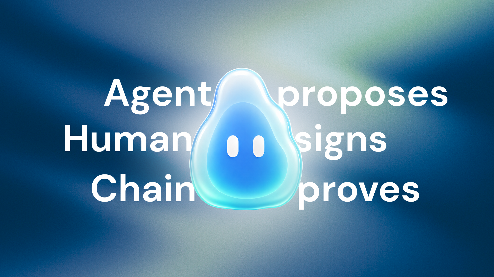
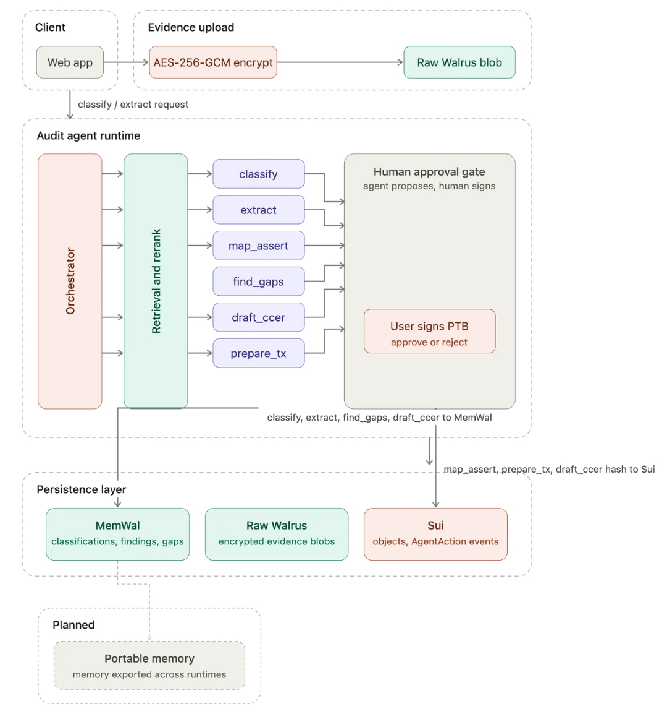

<div align="center">

<h1 align="center">Linow</h1>



<p align="center">
  
  
  
</p>

</div>

Linow is an AI audit agent that helps companies compliance prepare audit evidence quickly and helps auditors review engagements efficiently. The Sui are our tamper proof layer, more verifiable audit. Linow leverages Walrus portable memory for keeping the agent's context private even for sensitive company data and combines with contextual-retrieval and reranking mechanism layers to enhance our accurate agent, decrease failure rate and token efficiency. Linow AI made audit more verifiably, quickly, and automated.

## Core Model

- Linow registers evidence commitments, not truth claims.
- Raw evidence never goes on-chain.
- Verification checks file integrity, not business truth.
- Attestation is a separate reviewer object, not an evidence status.
- A company can register evidence, but a reviewer wallet must attest to it.
- All agent classifications and gap findings are stored persistently via MemWal (Walrus Memory) and anchored on Sui.

## How It Works



1. A company uploads an evidence file and tags it with audit context.
2. Linow's AI Agent classifies the evidence and identifies gaps against ISA 500 audit standards.
3. Linow hashes the file locally and encrypts it in the browser.
4. The encrypted payload is stored on Walrus.
5. An `EvidenceRecord` and `AuditPack` are registered on Sui. Agent actions are logged as on-chain events.
6. An auditor verifies the disclosed file against the on-chain commitment and agent findings.
7. A reviewer can create an `Attestation` tied to their wallet.

## Repo Layout

- `contracts/` - Sui Move package for evidence and attestation objects
- `app/` - Next.js workspace and product UI
- `sdk/` - shared client boundary and crypto helpers
- `docs/` - project docs, task archives, and design notes

## Local Development

```bash
cd app
npm install
npm run dev
```

The app builds the shared SDK package locally and runs the Linow workspace on `http://localhost:3000`.
